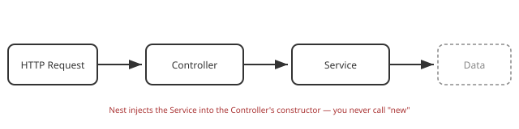

# Part 4: Services & Dependency Injection

## Table of Contents

1. [What Is a Service?](#1-what-is-a-service)
2. [Why Logic Doesn't Belong in the Controller](#2-why-logic-doesnt-belong-in-the-controller)
3. [Dependency Injection, Concretely](#3-dependency-injection-concretely)
4. [Moving Real Logic Into `TasksService`](#4-moving-real-logic-into-tasksservice)
5. [Beginner Pitfalls](#5-beginner-pitfalls)

---

## 1. What Is a Service?



A **service** is a class decorated with `@Injectable()` that holds
business logic and data access — everything a controller shouldn't have
to know about. `@Injectable()` marks the class as something Nest's
dependency injection container can create and hand to other classes.

## 2. Why Logic Doesn't Belong in the Controller

The controller's job is to translate HTTP ↔ application calls: read the
request, call a method, shape the response. If a `PATCH` handler starts
containing `if` statements about business rules, two problems show up
fast:

- The same logic can't be reused from anywhere except that one HTTP route
  (a background job, a CLI script, a test — none of them can call it
  without going through HTTP).
- Testing the logic means spinning up HTTP requests, instead of just
  calling a plain method.

Keeping logic in the service keeps the controller thin and the logic
reusable and independently testable.

## 3. Dependency Injection, Concretely

In [Part 3](03-controllers-and-routing.md), `TasksController`
already declared this:

```ts
constructor(private readonly tasksService: TasksService) {}
```

Nobody ever writes `new TasksService()`. Because `TasksService` is
`@Injectable()` and listed in `TasksModule`'s `providers`, Nest
constructs one instance of it and passes it into `TasksController`'s
constructor automatically when the app boots. This is **dependency
injection**: classes declare what they need, and the framework provides
it — you don't wire it by hand.

> **Note:** by default, Nest creates a single shared instance of a
> provider (a singleton) reused across every class that injects it.

## 4. Moving Real Logic Into `TasksService`

Replace the placeholder methods from [Part 3](03-controllers-and-routing.md)
with an in-memory implementation — real persistence arrives in
[Part 6](06-database-integration.md), but the shape of the
service won't change, only what's inside these methods:

```ts
// src/tasks/tasks.service.ts
import { Injectable, NotFoundException } from '@nestjs/common';

export interface Task {
  id: number;
  title: string;
  description?: string;
  done: boolean;
}

@Injectable()
export class TasksService {
  private tasks: Task[] = [];
  private nextId = 1;

  findAll(): Task[] {
    return this.tasks;
  }

  findOne(id: number): Task {
    const task = this.tasks.find((t) => t.id === id);
    if (!task) throw new NotFoundException(`Task ${id} not found`);
    return task;
  }

  create(data: { title: string; description?: string }): Task {
    const task: Task = { id: this.nextId++, done: false, ...data };
    this.tasks.push(task);
    return task;
  }

  update(id: number, data: Partial<Pick<Task, 'title' | 'description' | 'done'>>): Task {
    const task = this.findOne(id);
    Object.assign(task, data);
    return task;
  }

  remove(id: number): { removed: true } {
    const index = this.tasks.findIndex((t) => t.id === id);
    if (index === -1) throw new NotFoundException(`Task ${id} not found`);
    this.tasks.splice(index, 1);
    return { removed: true };
  }
}
```

`TasksController` doesn't need to change at all — it already just calls
`this.tasksService.*`. That's the payoff of the controller/service split:
the HTTP layer was done in [Part 3](03-controllers-and-routing.md)
and stays untouched while the real logic gets built underneath it.

## 5. Beginner Pitfalls

- **Injecting a class that isn't `@Injectable()`.** Nest can only
  construct and inject providers it knows about — a plain class without
  the decorator (or not listed in a module's `providers`) throws at
  startup.
- **Assuming a new instance per request.** Providers are singletons by
  default — don't store per-request state on `this` in a service, or two
  concurrent requests will stomp on each other's data.
- **Reaching into another module's service directly.** If `OrdersService`
  needs `TasksService`, it must be exported from `TasksModule` and
  imported into `OrdersModule` — see [Part 2](02-modules.md).

---

Next: [Part 5 — DTOs & Validation](05-dto-and-validation.md)
