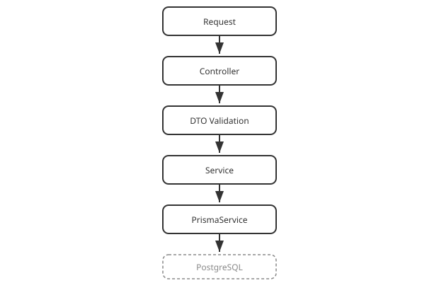

# Part 9: Architecture Review

## Table of Contents

1. [The Final Project Structure](#1-the-final-project-structure)
2. [The Request Lifecycle](#2-the-request-lifecycle)
3. [What We Deliberately Skipped](#3-what-we-deliberately-skipped)
4. [Where to Go Next](#4-where-to-go-next)

---

## 1. The Final Project Structure

```text
src/
├── prisma/
│   ├── prisma.module.ts
│   └── prisma.service.ts
├── tasks/
│   ├── dto/
│   │   ├── create-task.dto.ts
│   │   └── update-task.dto.ts
│   ├── tasks.controller.ts
│   ├── tasks.service.ts
│   └── tasks.module.ts
├── app.module.ts
└── main.ts

prisma/
└── schema.prisma
```

Every file here was built incrementally, in this order:

| Part | Added |
| --- | --- |
| [1](01-setup-and-project-creation.md) | The project itself, `main.ts` |
| [2](02-modules.md) | `tasks.module.ts` |
| [3](03-controllers-and-routing.md) | `tasks.controller.ts` |
| [4](04-services-and-dependency-injection.md) | `tasks.service.ts` (in-memory) |
| [5](05-dto-and-validation.md) | `dto/`, `ValidationPipe` |
| [6](06-database-integration.md) | `prisma/`, `tasks.service.ts` rewritten against Prisma |
| [7](07-error-handling.md) | `NotFoundException` / `ConflictException` usage |
| [8](08-api-documentation-swagger.md) | Swagger UI at `/api` |

## 2. The Request Lifecycle



Every request into `/tasks` now travels the same path:

**Request → Controller → DTO Validation → Service → PrismaService →
PostgreSQL → Service → Controller → Response**

This is the core idea to take away from this whole crash course: Nest
isn't a pile of decorators to memorize — it's this one consistent flow,
with a clear, single-responsibility layer for each step.

## 3. What We Deliberately Skipped

This was a 1-hour crash course, not the whole framework. Left out on
purpose, each worth its own dedicated learning time:

Guards, interceptors, middleware, pipes in depth, custom decorators,
authentication/JWT, authorization/RBAC, WebSockets, microservices,
queues, caching, testing, GraphQL, file upload, advanced database
patterns.

## 4. Where to Go Next

If you want to go from "I can build a small API" to "I can build a
production-style e-commerce API, live, with a cohort" — including proper
authentication, authorization, payments (Bakong), and deployment (Sabay
Cloud) — that's exactly what the paid, live cohort this crash course
funnels into covers, over 3 months.

---

Back to: [Crash Course overview](../README.md)
